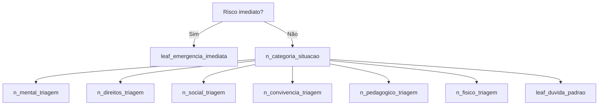
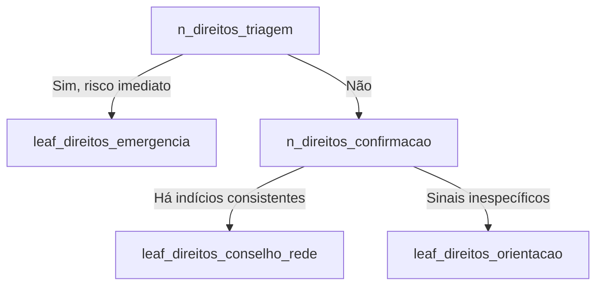

# Fluxogramas do Decisor Escolar (Mermaid + texto)

> Referência: árvore `decisionTree` em `content/protocolData.ts`.

## Visão geral

## Cenários folha existentes

### 1) leaf_emergencia_imediata
- **Quando acionar:** risco imediato à vida/integridade.
- **Resumo:** acionar emergência e informar gestão escolar sem atraso.

### 2) leaf_duvida_padrao
- **Quando acionar:** classificação incerta.
- **Resumo:** proteger estudante, escalar para gestão e usar UBS/urgência quando necessário.

### 3) leaf_mental_agudo
- **Quando acionar:** risco autolesivo/crise intensa.
- **Resumo:** gestão imediata + CAPS/UBS, com emergência se houver risco físico.

### 4) leaf_mental_ubs
- **Quando acionar:** sofrimento persistente com impacto escolar.
- **Resumo:** gestão + UBS e monitoramento de sinais de alerta.

### 5) leaf_mental_acomp_escola
- **Quando acionar:** situação emocional leve, sem risco imediato.
- **Resumo:** acolhimento escolar, acompanhamento e escalonamento se piora.

### 6) leaf_direitos_emergencia
- **Quando acionar:** violação de direitos com risco atual.
- **Resumo:** proteção imediata, emergência e rede protetiva (CT/CREAS).

### 7) leaf_direitos_conselho_rede
- **Quando acionar:** violação sem risco iminente.
- **Resumo:** gestão + Conselho Tutelar (CT) + CREAS, com registro institucional.

### 8) leaf_direitos_orientacao
- **Quando acionar:** sinais inespecíficos de violação.
- **Resumo:** escalar para gestão e reclassificar se surgirem novos riscos.

### 9) leaf_social_rede
- **Quando acionar:** vulnerabilidade social/familiar persistente.
- **Resumo:** gestão + CRAS e acompanhamento de proteção social.

### 10) leaf_social_escola
- **Quando acionar:** necessidade social leve com suporte escolar inicial.
- **Resumo:** apoio escolar e escalonamento conforme evolução.

### 11) leaf_convivencia_grave
- **Quando acionar:** conflito grave com ameaça/violência.
- **Resumo:** proteger envolvidos e acionar gestão/rede protetiva.

### 12) leaf_convivencia_restaurativa
- **Quando acionar:** conflito sem risco imediato.
- **Resumo:** mediação pedagógica com acompanhamento da gestão.

### 13) leaf_pedagogico_multifatorial
- **Quando acionar:** dificuldade persistente com múltiplos fatores.
- **Resumo:** plano integrado escola-família-rede.

### 14) leaf_pedagogico_escolar
- **Quando acionar:** dificuldade pedagógica sem risco associado.
- **Resumo:** intervenção pedagógica e monitoramento.

### 15) leaf_fisico_urgente
- **Quando acionar:** sintomas físicos graves/urgentes.
- **Resumo:** emergência/UPA e comunicação imediata à gestão.

### 16) leaf_fisico_ubs
- **Quando acionar:** queixa física sem gravidade imediata.
- **Resumo:** UBS como porta de entrada e acompanhamento escolar.

## Exemplo detalhado (direitos com risco)

- **Objetivo do fluxo:** evitar omissão em suspeita de violência.
- **Regra de segurança:** em dúvida, manter proteção e escalar gestão.
